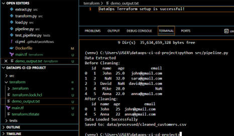
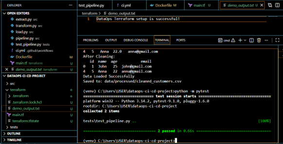
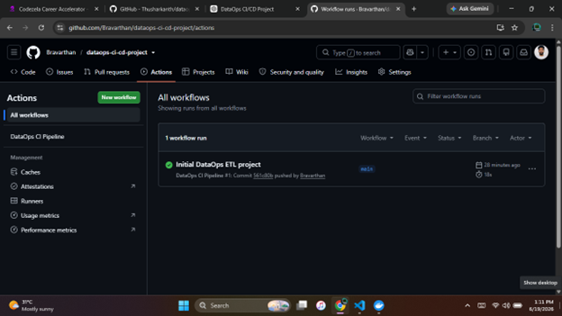
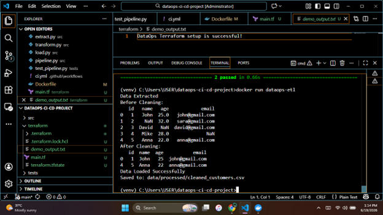
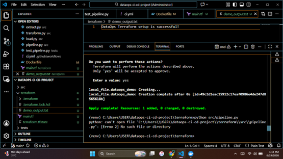

# 📌 DataOps CI/CD Project

---

## 📖 Project Overview
This project demonstrates a complete DataOps workflow by integrating ETL pipeline development, automated testing, CI/CD automation, containerization, and Infrastructure as Code (IaC).

The goal is to apply modern DevOps practices to a simple data engineering pipeline to improve reliability, automation, and reproducibility.

---

## 🎯 Objectives
- Build a simple ETL pipeline using Python
- Apply data cleaning and transformation techniques
- Implement automated testing using Pytest
- Use GitHub Actions for CI/CD automation
- Containerize the application using Docker
- Demonstrate Infrastructure as Code using Terraform

---

## 🏗️ Project Workflow

```
Raw Data → Extract → Transform → Load → Testing → CI/CD → Docker → Terraform
```

---

## 🧰 Technologies Used
- Python
- Pandas
- Pytest
- GitHub Actions
- Docker
- Terraform
- Git & GitHub

---

## 📁 Project Structure

```
dataops-ci-cd-project/
│
├── src/
│   ├── extract.py
│   ├── transform.py
│   ├── load.py
│   └── pipeline.py
│
├── tests/
│   └── test_pipeline.py
│
├── data/
│   ├── raw/
│   └── processed/
│
├── .github/
│   └── workflows/
│       └── ci.yml
│
├── terraform/
│   └── main.tf
│
├── screenshots/
│   ├── docker-run-output.png
│   ├── etl-pipeline-running.png
│   ├── github-actions-success.png
│   ├── pytest-success.png
│   └── terraform-apply-success.png
│
├── Dockerfile
├── requirements.txt
└── README.md
```

---

## 🚀 How to Run the Project

### 1. Clone Repository
```bash
git clone https://github.com/Bravarthan/dataops-ci-cd-project.git
cd dataops-ci-cd-project
```

### 2. Install Dependencies
```bash
pip install -r requirements.txt
```

### 3. Run ETL Pipeline
```bash
python src/pipeline.py
```

### 4. Run Tests
```bash
python -m pytest
```

### 5. Run with Docker
```bash
docker build -t dataops-etl .
docker run dataops-etl
```

### 6. Run Terraform
```bash
cd terraform
terraform init
terraform apply
```

---

## 🖼️ Screenshots

### ETL Pipeline Running


### Pytest Successful Output


### GitHub Actions Success


### Docker Run Output


### Terraform Apply Success


---

## ⚙️ CI/CD Pipeline (GitHub Actions)
Every push or pull request automatically:
- Checks out code
- Installs dependencies
- Runs automated tests (pytest)

---

## 🐳 Docker
The project is containerized using Docker to ensure consistent execution across environments.

---

## ☁️ Terraform (IaC)
Terraform is used to demonstrate Infrastructure as Code by creating a simple local file resource.

---

## 📊 Key Learning Outcomes
- Understanding DataOps principles
- Building ETL pipelines
- Writing automated test cases
- Using CI/CD pipelines
- Containerizing applications
- Applying Infrastructure as Code concepts

---

## 📌 Author
**Bravarthan Sharma**
